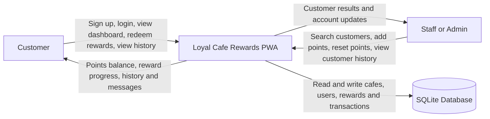
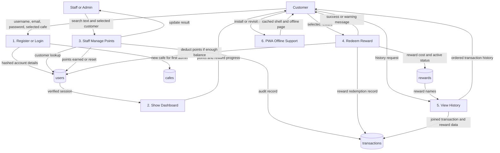

# Data Flow Diagrams

These diagrams are based on the current Flask application in `2026-Y12-SE-SevenFlood-pwa-flask-application`.

## Level 0 Context Diagram

## Level 1 Data Flow Diagram

## Reflection

The original idea was a simple digital stamp card, but the Flask implementation became a points-based loyalty system. This made the design stronger because points, rewards and transactions can all be tracked in the database. The main challenge was keeping customer actions separate from staff/admin actions, so the data flow diagram now shows both user groups clearly.
