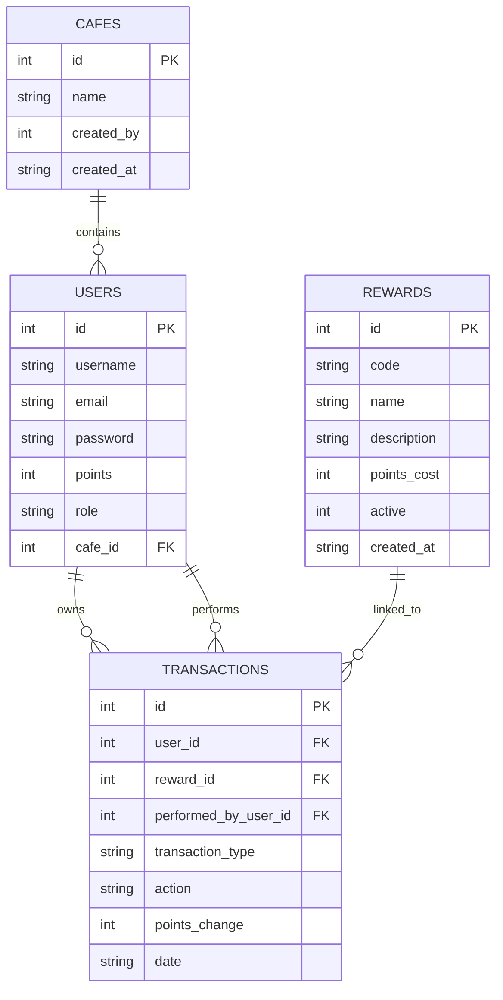

# Entity Relationship Diagram

This ERD matches the SQLite schema implemented in `src/data.py` in the Flask application.

## Database Plan

The implemented database uses four main tables:

- **cafes** stores cafe names created by admin accounts.
- **users** stores customer, staff and admin accounts, including hashed passwords, role, cafe and points balance.
- **rewards** stores redeemable rewards such as free coffee and free muffin.
- **transactions** stores point changes, reward redemptions, staff actions and account resets.

The application uses foreign keys and indexes so customer history can be joined with reward and staff information.

## Reflection

The database design changed from a basic stamp-card idea into a normalised points system. This solved a weakness in the early design because the app can now show a full transaction history instead of only showing the current total. A future improvement would be to store cafe-specific rewards so different cafes can configure their own loyalty offers.
