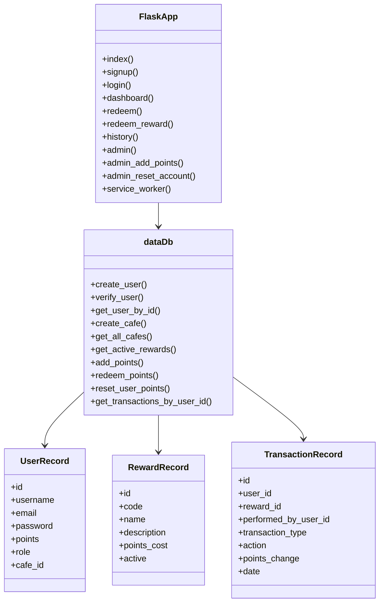

# Class Diagram

The current Flask app mainly uses route functions in `src/app.py` and a database access class in `src/data.py`. This diagram shows the implemented structure.

## Design Notes

The `dataDb` class is responsible for SQLite database operations. The Flask route functions handle user actions such as signing up, logging in, viewing the dashboard, redeeming rewards and staff/admin management.

## Reflection

The implementation uses a simple Flask structure instead of many separate model classes. This kept the project easier to understand for a school PWA, but a future improvement would be to split the routes into blueprints and move validation into smaller helper modules.
